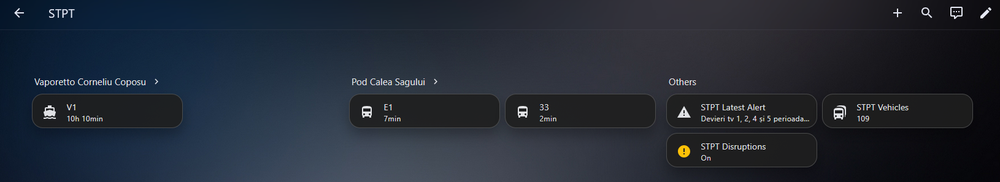
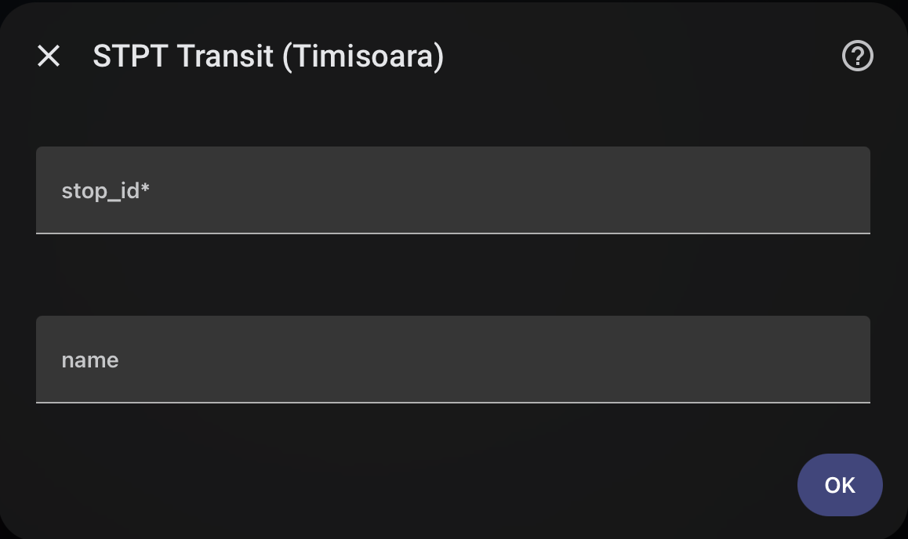
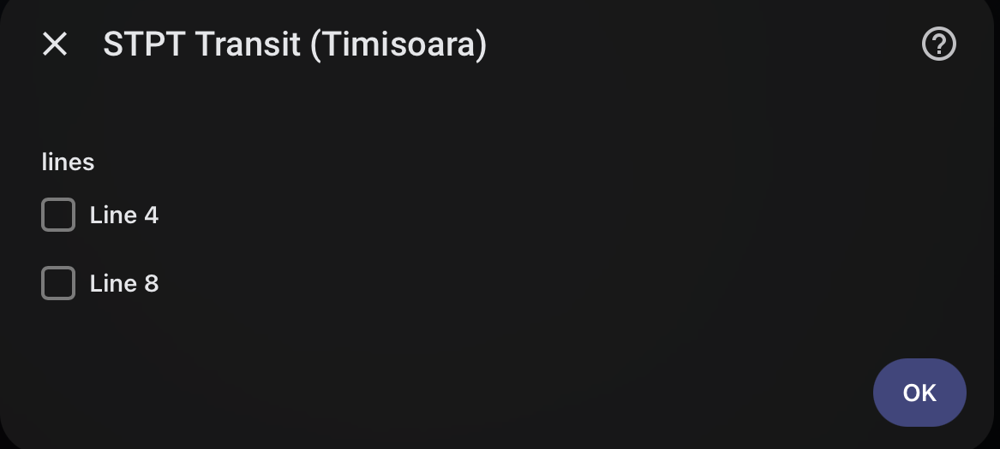
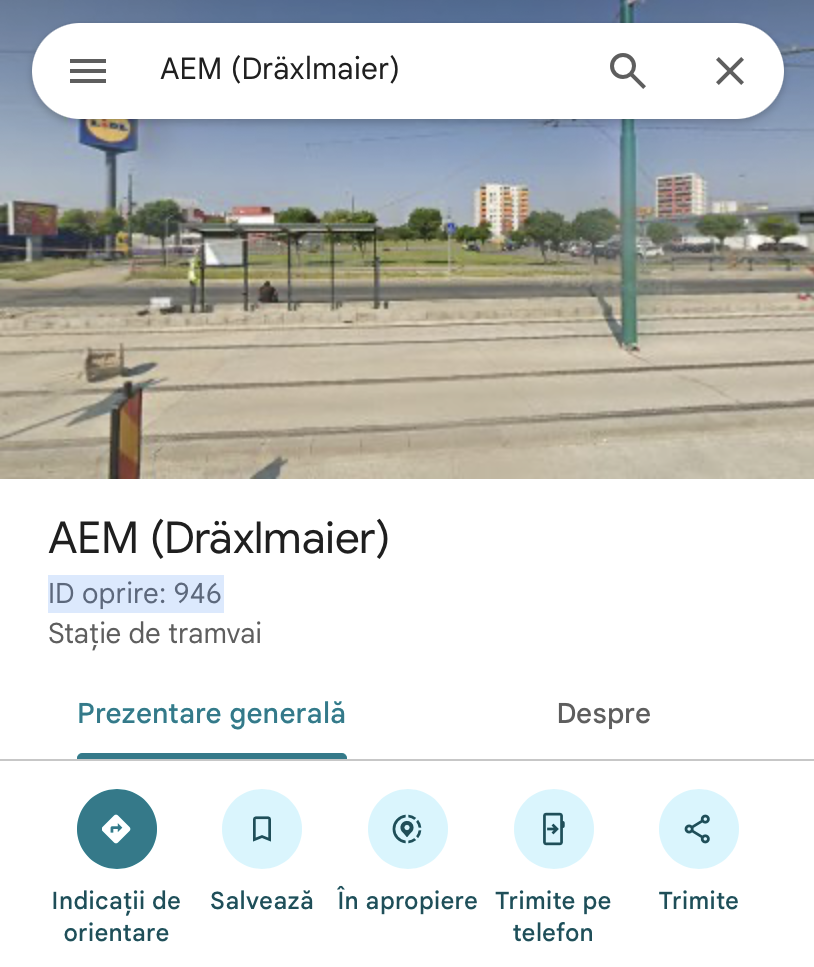

# STPT Transit — Integrare Home Assistant

> Vizualizează și [Dashboard-ul pe cerneală electronică Inky pHAT](https://github.com/vladirocox/inkystpt) — un afișaj e-ink pentru plecări STPT, vreme și redări Chromecast.

Monitorizează stațiile de autobuz/tramvai/troleibuz STPT (Societatea de Transport Public Timișoara) în timp real, cu suport complet pentru automatizări.



## Funcționalități

- **Sosiri în timp real** — interoghează `live.stpt.ro` la un interval configurabil (implicit 10s, interval 5-120s)
- **Program de rezervă** — când API-ul live nu returnează date, folosește programul preluat de pe `smtt.ro` (cache 1h)
- **Stații multiple** — monitorizează oricâte; adaugă/elimină oricând din UI
- **Senzori pe linie** — fiecare linie are propriul senzor cu minutele până la următoarea sosire
- **Urmărire vehicule** — numărul total de vehicule active defalcat pe linii
- **Coordonate stații** — lat/lng din rețeaua de rute disponibile ca atribute pentru hartă
- **Monitorizare alerte** — senzor binar pentru întreruperi STPT
- **Interogare configurabilă** — interval de reîmprospătare între 5 și 120 de secunde

## Instalare

### Prin HACS (recomandat)

1. Asigură-te că [HACS](https://hacs.xyz) este instalat
2. Mergi la **HACS → Integrations → meniul cu trei puncte → Custom repositories**
3. Adaugă: `https://github.com/vladirocox/stpt-ha-integration` cu categoria **Integration**
4. Apasă **Install** pe cardul "STPT Transit"
5. Repornește Home Assistant

### Manual

1. Copiază `custom_components/stpt_transit/` în directorul `custom_components/` al HA-ului tău
2. Repornește Home Assistant

## Configurare

1. Mergi la **Settings → Devices & Services → Add Integration**
2. Caută **"STPT Transit"**
3. Introdu **ID-ul stației** (ex: `326` pentru Catedrala Metropolitană)
4. Opțional, selectează liniile de monitorizat la acea stație





### Cum găsești ID-ul unei stații

1. Deschide Google Maps și navighează la stația de autobuz/tramvai
2. Apasă pe markerul stației — apare un popup cu detalii
3. Caută **numărul stației** (ID-urile STPT sunt numerice, ex: `326`, `74`, `1122`)

Alternativ, vizitează `https://live.stpt.ro`, caută stația și notează parametrul `stopid=N` din URL.



### Adăugarea stațiilor

După configurare, mergi la **Settings → Devices & Services → STPT Transit → Configure** pentru a adăuga sau elimina stații.

1. Selectează **"Add a station"**
2. Introdu **ID-ul stației** și opțional un nume
3. Alege liniile de monitorizat (sau acceptă-le pe toate)
4. Senzorii noii stații apar automat

Alternativ, folosește scriptul CLI:

```bash
docker exec homeassistant python3 /config/custom_components/stpt_transit/tools/manage_stations.py add 326 "Catedrala Metropolitană"
docker restart homeassistant
```

## Senzori

Fiecare stație creează un senzor per linie monitorizată. Starea senzorului reprezintă **minutele până la următoarea sosire** (valoare numerică, potrivită pentru automatizări).

| Atribut | Tip | Descriere |
|---------|-----|-----------|
| `state` | int sau null | Minute până la următorul vehicul (sau `null` dacă nu sunt date) |
| `unit_of_measurement` | `min` | Pentru grafice |
| `stop_id` | str | ID-ul stației STPT |
| `station_name` | str | Numele stației |
| `line` | str | Numărul liniei |
| `latitude` | float | Latitudinea GPS a stației (din rețeaua de rute) |
| `longitude` | float | Longitudinea GPS a stației (din rețeaua de rute) |
| `source` | str | `"live"` (din API) sau `"schedule"` (program de rezervă) |
| `arrivals` | list | Lista sosirilor cu linie, destinație, minute, tip |
| `arrival_count` | int | Numărul de sosiri viitoare pentru această linie |
| `destination` | str | Destinația următorului vehicul |
| `next_arrival_time` | str | Ora programată a sosirii (format HH:MM) |
| `vehicle_type` | str | `"tram"`, `"trolley"` sau `"bus"` |
| `error` | str sau null | Mesaj de eroare dacă preluarea a eșuat |

Un senzor **Vehicule** (`sensor.stpt_vehicles`) arată numărul total de vehicule active și defalcarea pe linii.

## Automatizări

Starea senzorului este numerică (minute), deci trigger-ele `numeric_state` funcționează direct:

### Notificare înainte de sosire

```yaml
alias: "Autobuzul sosește în 5 minute"
trigger:
  - platform: numeric_state
    entity_id: sensor.catedrala_metropolitana_1
    below: 5
condition:
  - condition: template
    value_template: "{{ state_attr('sensor.catedrala_metropolitana_1', 'source') == 'live' }}"
action:
  - service: notify.mobile_app
    data:
      title: "Autobuzul sosește în curând!"
      message: >
        Linia {{ state_attr('sensor.catedrala_metropolitana_1', 'destination') }}
        sosește în {{ states('sensor.catedrala_metropolitana_1') }} minute
mode: single
```

### Aprinde lumina la sosire

```yaml
alias: "Autobuzul a sosit"
trigger:
  - platform: numeric_state
    entity_id: sensor.catedrala_metropolitana_1
    below: 1
action:
  - service: light.turn_on
    target:
      entity_id: light.living_room
    data:
      flash: short
mode: single
```

## Surse de date

- **API live**: `https://live.stpt.ro/proxy-smtt-cache.php?stopid=N`
- **API vehicule**: `https://live.stpt.ro/gtfs-vehicles.php`
- **Program**: `https://smtt.ro/linie-transport-public-{LINE}/` (cache 1h, HTML)

## Dezvoltare

```bash
cp -r custom_components/stpt_transit /path/to/ha/custom_components/
docker restart homeassistant
```

## Contribuții

Vrei să contribui? Ai găsit o problemă sau ai o sugestie? Deschide un issue sau un pull request pe [GitHub](https://github.com/vladirocox/stpt-ha-integration).

**Problemă cunoscută**: la adăugarea unei noi stații prin opțiuni, fiecare stație generează 3 entități de alertă identice. Lucrez la eliminarea duplicatelor — dacă te pricepi la registry-ul de entități HA, ajutorul e binevenit.

## Licență

MIT
